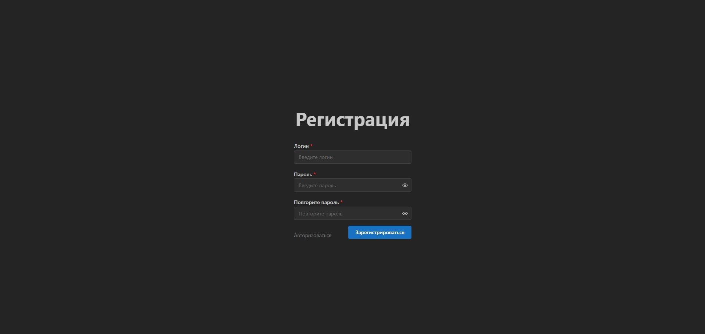
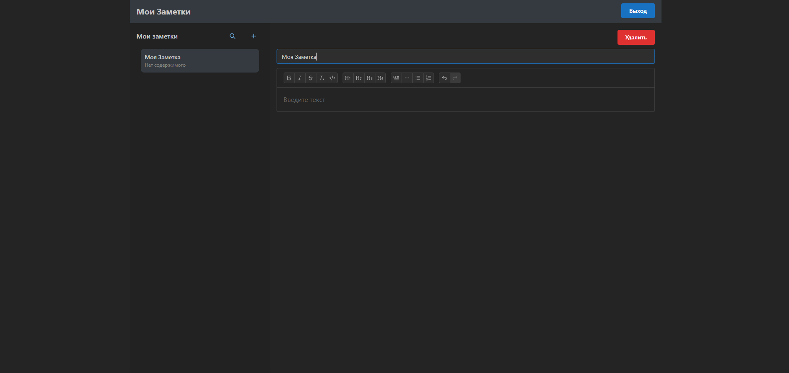
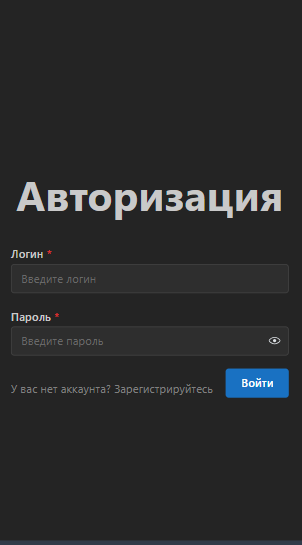
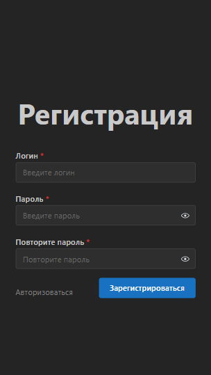
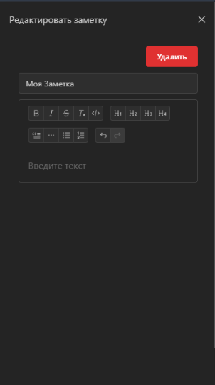

# DZ Notes 📝

Упрощённая копия приложения «Заметки» из macOS, созданная с использованием современного фронтенд-стека.

## 🚀 Стек технологий

- **React 19** + **TypeScript**
- **Vite** для сборки
- **React Router v6**
- **Mantine UI** — для компонентов и редактора
- **Tiptap** — расширяемый редактор текста
- **Firebase** — аутентификация и хранение данных
- **PWA** — работает в оффлайн-режиме
- **Context API** + кастомные хуки
- Архитектура: **Feature-Sliced Design (FSD)**

## 📱 Возможности

- Авторизация и регистрация пользователей
- Просмотр и редактирование заметок
- Автосохранение текста при редактировании
- Rich text-редактор с поддержкой форматирования
- Поиск по заметкам по части слова
- Удаление заметки с подтверждением
- Полностью адаптивный интерфейс: десктоп + мобильный
- Работа в оффлайне (PWA)

## 🔗 Веб-приложение

[https://notes-result-university-middle.web.app/auth](https://notes-result-university-middle.web.app/auth)

## 🖼️ Скриншоты

### Десктопный режим
<p float="left">
  
  
  
</p>

### Мобильный режим
<p float="left">
  
  
  
  
</p>

## ⚙️ Установка и запуск

```bash
# Установить зависимости
npm install

# Запустить проект в dev-режиме
npm run dev

# Собрать production-бандл
npm run build

# Просмотр собранного проекта локально
npm run preview

# Проверка линтера
npm run lint
```
